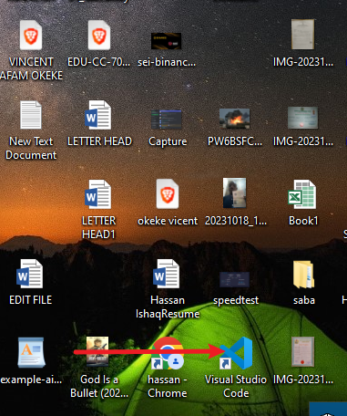
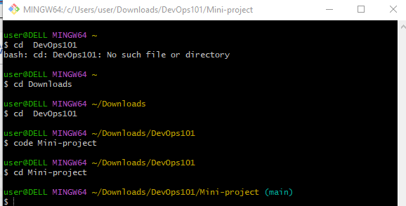
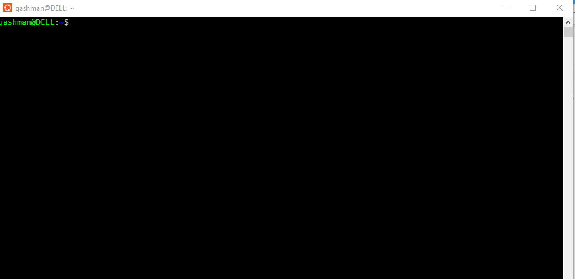
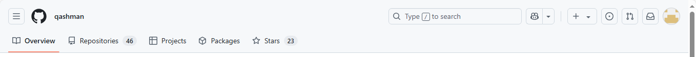

# Mini-project

## Tech Environment Setup

#### Tools to installed 

### VScode

### GIT

### VirtualBox

### Ubuntu On VirtualBox (Window)

Accounts Created
---
### Github account

### Amazon web Service (AWS) Account

